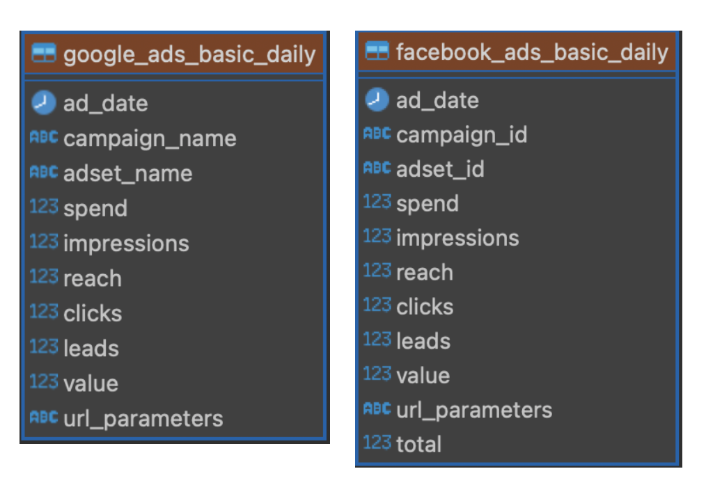
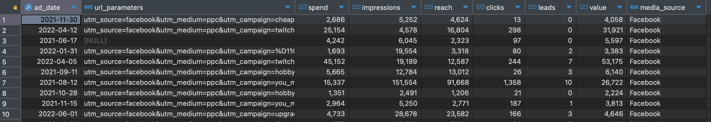
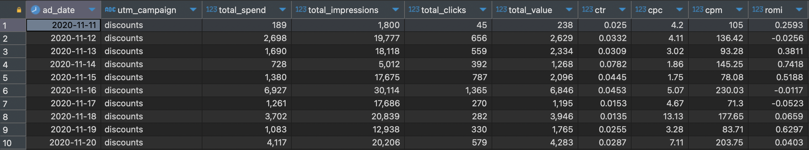

# Ad Campaign Aggregation & KPI Calculation

This project unifies daily ad metrics from Facebook & Google, handles missing values, extracts UTM campaign tags, and computes key performance indicators (CTR, CPC, CPM, ROMI) per campaign per day.

---

## Data & Schema

- **Source tables**:  
  - `facebook_ads_basic_daily`  
  - `google_ads_basic_daily`
- **Columns**:  
  - `ad_date` (DATE)  
  - `url_parameters` (TEXT with UTM params)  
  - `spend`, `impressions`, `reach`, `clicks`, `leads`, `value` (NUMERIC)  
- **ER Diagram**
<p align="center">
  
</p>
  A simple two-table layout, each with identical columns, to be UNION-ALL’d in our CTE.


---

## SQL Query

```sql
-- Step 1: Combine Facebook & Google, replace NULLs with 0
WITH combined AS (
  SELECT
    ad_date,
    url_parameters,
    COALESCE(spend, 0)      AS spend,
    COALESCE(impressions, 0) AS impressions,
    COALESCE(reach, 0)       AS reach,
    COALESCE(clicks, 0)      AS clicks,
    COALESCE(leads, 0)       AS leads,
    COALESCE(value, 0)       AS value,
    'Facebook'               AS media_source
  FROM facebook_ads_basic_daily

  UNION ALL

  SELECT
    ad_date,
    url_parameters,
    COALESCE(spend, 0),
    COALESCE(impressions, 0),
    COALESCE(reach, 0),
    COALESCE(clicks, 0),
    COALESCE(leads, 0),
    COALESCE(value, 0),
    'Google'                 AS media_source
  FROM google_ads_basic_daily
)

-- Step 2: Extract UTM campaign, aggregate metrics, compute KPIs
SELECT
  ad_date,
  NULLIF(
    LOWER(
      SUBSTRING(url_parameters, 'utm_campaign=([^&]+)')
    ),
    'nan'
  )                       AS utm_campaign,
  SUM(spend)              AS total_spend,
  SUM(impressions)        AS total_impressions,
  SUM(clicks)             AS total_clicks,
  SUM(value)              AS total_value,

  -- CTR: clicks / impressions
  CASE
    WHEN SUM(impressions) > 0 THEN ROUND(SUM(clicks)::NUMERIC / SUM(impressions), 4)
    ELSE 0
  END                      AS ctr,

  -- CPC: spend / clicks
  CASE
    WHEN SUM(clicks) > 0     THEN ROUND(SUM(spend)::NUMERIC / SUM(clicks), 2)
    ELSE 0
  END                      AS cpc,

  -- CPM: (spend / impressions) * 1000
  CASE
    WHEN SUM(impressions) > 0 THEN ROUND((SUM(spend)::NUMERIC / SUM(impressions)) * 1000, 2)
    ELSE 0
  END                      AS cpm,

  -- ROMI: (value / spend) - 1
  CASE
    WHEN SUM(spend) > 0      THEN ROUND((SUM(value)::NUMERIC / SUM(spend)) - 1, 4)
    ELSE NULL
  END                      AS romi

FROM combined
GROUP BY ad_date, utm_campaign
ORDER BY ad_date, utm_campaign;
```


## Results

### Combined CTE Output


### Aggregated KPIs

